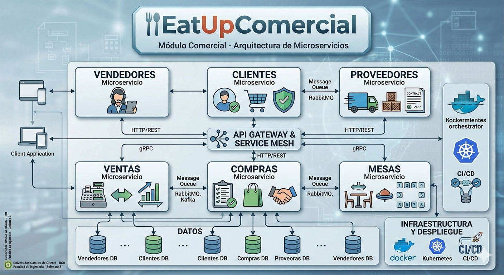
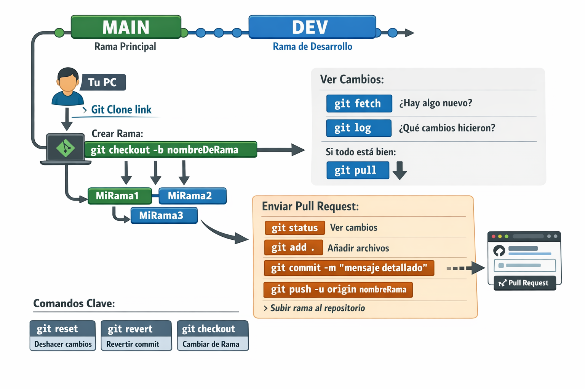

# EatUpComercial 🍽️

Bienvenido al repositorio central del **Módulo Comercial** de la aplicación **EatUp**. Este proyecto se desarrolla bajo una arquitectura de **microservicios** como parte de la materia **Software 3** en la **Universidad Católica de Oriente (UCO)**.

---

## 📌 Información del Proyecto
* **Semestre:** 2026-1
* **Institución:** Universidad Católica de Oriente (Rionegro, Antioquia)
* **Materia:** Software 3
* **Docente:** NOREÑA BLANDÓN JUAN PABLO

---

## 🏗️ Arquitectura de Microservicios
El sistema está diseñado para ser escalable e independiente. El módulo comercial se divide en los siguientes microservicios, donde cada integrante del equipo tiene la responsabilidad de un componente específico:


<p align="center">
  
</p>

### Equipo de Desarrollo y Responsables

| Microservicio | Responsable | Foto (Click para ir al Perfil) |
| :--- | :--- | :---: |
| **VENDEDORES** | *Andrea Avendaño Jurado* | <a href="https://github.com/Anxdrx"></a> |
| **CLIENTES** | *Nombre del Estudiante* | <a href="https://github.com/USUARIO_DE_GITHUB"></a> |
| **PROVEEDORES** | *Nombre del Estudiante* | <a href="https://github.com/USUARIO_DE_GITHUB"></a> |
| **VENTAS** | *Andres Felipe Velez Alcaraz* | <a href="https://github.com/andrias01"></a> |
| **COMPRAS** | *Nombre del Estudiante* | <a href="https://github.com/USUARIO_DE_GITHUB"></a> |
| **MESAS** | *Nombre del Estudiante* | <a href="https://github.com/USUARIO_DE_GITHUB"></a> |

---

## 📁 Estructura del Repositorio
Cada carpeta a nivel de raíz representa un microservicio independiente.

```bash
EatUpComercial/
├── VENDEDORES/      # Gestión de personal de ventas
├── CLIENTES/        # Registro y fidelización de usuarios
├── PROVEEDORES/     # Gestión de suministros y contactos
├── VENTAS/          # Procesamiento de pedidos y facturación
├── COMPRAS/         # Gestión de inventario y egresos
├── MESAS/           # Control y disponibilidad de áreas físicas
└── imagenesReadme/  # Recursos visuales del proyecto (Fotos y diagramas)
```

<p align="center">
  
</p>

## 🚀 FLUJO DE TRABAJO GITHUB - PROYECTO

```bash
# 1️⃣ Clonar repositorio
git clone <URL_DEL_REPOSITORIO>

# 2️⃣ Entrar al proyecto
cd nombre-del-proyecto

# 3️⃣ Cambiar a rama de desarrollo
git checkout dev

# 4️⃣ Crear rama para nueva funcionalidad
git checkout -b nombreDeRama

# Verificar rama actual
git branch

# ==========================================
# 🔎 ANTES DE SUBIR CAMBIOS (IMPORTANTE)
# ==========================================

# Ver si hay cambios nuevos en el repositorio remoto
git fetch

# Revisar qué cambios hicieron otros compañeros
git log --oneline --graph --all
# o Tambian
git loc

# Si no afecta tu trabajo, actualizar tu rama
git pull origin DEV

# ==========================================
# 📦 PREPARAR CAMBIOS
# ==========================================

# Ver qué archivos cambiaron
git status

# Agregar cambios al stage
git add .

# Crear commit con mensaje claro y detallado
git commit -m "Descripción clara y detallada de la funcionalidad implementada"

# Subir rama al repositorio
git push -u origin nombreDeRama

# ==========================================
# 🔁 CREAR PULL REQUEST
# ==========================================
# Ir a GitHub
# Crear Pull Request hacia la rama DEV
# En el repositorio en la nube debe aparcer Compare & pull request aqui poner un buen titulo y una excelente descripción
# Ya listo lo anterior dar click en Create pull request esperar que gitHub compare esa rama con la DEV con el fin de no encontrar un conflicto.
# Esperar revisión del equipo IMPORTENTE antes de dar click en Merge pull requies
# Luego de fucionar la rama con DEV te desplazas mas abajo y buscas Delete branch
# Asi eliminas la rama que usastes ya que cumplio su objetivo. 
# Puedo seguir con ese nombre de rama de formar local para seguir realizando nuevas funcionalidades y seguir el mismo flujo.

# ==========================================
# 🛠 COMANDOS IMPORTANTES
# ==========================================

# Cambiar de rama
git checkout nombreDeRama

# ⚠️ PELIGROSO ⚠️
# Este comando ELIMINA TODOS los cambios locales
# que no estén guardados en un commit.
# No se pueden recuperar fácilmente.
git reset --hard

# Revertir un commit SIN borrar historial (más seguro)
git revert <hash_del_commit>

# ==========================================
# 🌳 ESTRUCTURA DE RAMAS
# ==========================================
# main  -> Producción (estable)
# DEV   -> Desarrollo
# nombreRamasIndividuales/* -> Ramas individuales

```